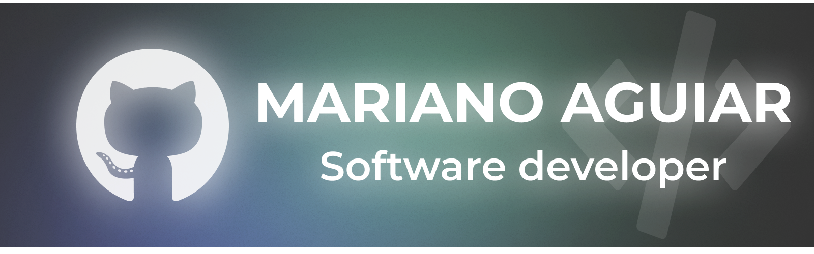

<h2 align="center">Hi 👋, I'm Mariano Aguiar</h1>
<h2 align="center">I'm a passionate young software developer for backend devlopment and database manipulation. I love to transforming ideas into digital products</h3
 

<h2 align="left">💻 Skills and Tools:</h2>
<ul>
  <li>Frontend Skills:
      HTML, CSS, Flexbox, Javascript, Bootstrap, ReactJS/native
  </li>
  <li>Backend Skills:
      Java, PHP, Python, NodeJS, ExpressJS, restAPI, JSON, MVC, SQL
  </li>
  <li>Tools:
      XAMPP, Figma, MySQL, Expo, Postman, VScode/VS, Git & Github, Jira, CLI, UML, NPM & NPX
  </li>
</ul>
<h2 align="left">📊 Github stats:</h2>
 

    

 

  

